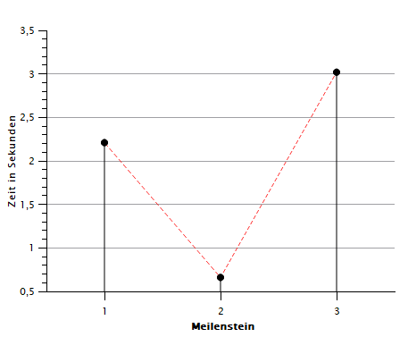

# Milestone IV Documentation

## Refactoring and improvements

The refactoring mainly consisted of implementing bitboards because we weren't able to identify the exact cause of the bugs in the previous milestones code.
Unfortunately, due to the bugs in our previous milestone, we had to rewrite the entire engine from scratch. 

### Implementation of Bitboards

Implementing bitboards helped us in creating a more structured approach to the move generation and AI algorithms.

Things we changed:
- we created the class `bitboard` and put all necessary functions into it
- seperating the move generation for each piece type
- directly checking special moves in the move generation

By introducing the bitboard class and including all related functions into it, we were able to make the code a lot more structured and easier to work with. 

Another bigger change we made was separating the move generation for each piece type. This made the code way less prone to bugs.
This separation also makes the code more modular and more readable.

Another improvement was that we now directly check special moves during the move generation. Previously, we needed to rely on additional functions such as `like is_legal_move()` to make sure no illegal moves were made. 

### Time and Effort

As mentioned, we weren't able to go with the "Copy and paste" process using our old code.
As a result, implementing the bitboard approach took up a detrimental amount of the total time spent working on Milestone IV.

While the time investment was significant, implementing the bitboards or at least doing a complete refactoring of the existing code was inevitable for the engine to not have major bugs.

### Other improvements

Apart from the main engine, we also did major refactoring of `alpha_beta.py`  and  `evaluate.py`.

These are some of the most noteworthy improvements:
- refactoring the code so it works with bitboards
- making the alpha_beta search significantly more compact so it is less ressource intensive
- removing unnecessary copies of the bitboard class in alpha_beta
- fixing the evaluation which had some bugs in milestone III
- improving the function of early- and midgame evaluation

## AI improvements

To improve the algorithm we used in milestone III, we focused on implementing the Monte Carlo Tree Search.

In order to do that we used the Upper Confidence Bound formula: 

`ucb = curr_node.v + 2*(sqrt(log(curr_node.N+e+(10*-6))/(curr_node.n+(10*-10))))`

- v = winning score as an evaluation of the current board
- N = number of times parent node has been visited
- n = number of times child node has been visited
- to avoid zero division exceptions we added 1/10⁶ and 1/10¹⁰ in the formula

Now, the AI is better at general decision-making, adaptability and the overall ability to explore new moves.
This is a major improvement compared to milestone III and II.

It's hard to directly show how the AI improved, but here are the things we mainly noticed:
- the AI doesn't blindly do captures anymore just to win material
- it is now able to recreate rather effective structures and openings, for example the english opening at depth 3 in the start position
- there is more structure and logic in the selection of the move itself

## Benchmark

The hardware we used for the benchmarks is the same as in milestone III:
- AMD Ryzen 5 3600X
- RTX 3070
- 16GB DDR4

Because we completely refactored the code, we took another look at the difference in speed compared to our last milestones.
In the following figures, we compare the speed of all milestones except milestone I with the start_position FEN:

`rnbqkbnr/pppppppp/8/8/8/8/PPPPPPPP/RNBQKBNR w KQkq - 0 1`

    
     
    Figure 1: Comparing the speed of the different milestones for the starting position at depth 1

    
     
    Figure 2: Comparing the speed of the different milestones for the starting position at depth 2

    
     
    Figure 3: Comparing the speed of the different milestones for the starting position at depth 3

Even though in theory bitboards should be faster than our previous 0x88 approach, when comparing the speed of milestone III to milestone IV, a drop in speed is clearly noticable.

For small depths, the speed is still better than the unoptimised code at Milestone III, which isn't the case at depth 3 and above.

The reason for that is probably because to make the bitboard approach work, we had to implement quite a few nonoptimal board_position and piece_information transformations.
These transformations require additional storage to hold intermediate results or temporary data structures which get dropped later on without making efficient use of them.

## Learnings

1. Incremental Development: Instead of rewriting the entire engine from scratch, next time we should consider adopting an incremental development approach. 
We should break down the project into smaller and more manageable tasks and focus on implementing and testing them one at a time. This way, it's way easier to find and fix new bugs and make faster progress.
2. Increase code reviews: After finishing a current task, one should always ask at least one team member to review the changes.
Having multiple people look at the changes of the code can help identify potential issues or improvements and improve the overall quality of the code.
3. Profiling and Optimization Tools: One should look include these kinds of tools after making major changes to the code to reduce performance bottlenecks in the code.
   We could have saved a lot of time fixing our algorithms, data structures or identifying unnecessary computations with it.
